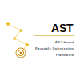

<p align="center">
  <picture>
    <source media="(prefers-color-scheme: dark)" srcset="docs/logo-dark.svg">
    
  </picture>
</p>

# ASTro: AST-based Reusable Optimization Framework

> Note: This project is still experimental, and the API is subject to significant changes.

ASTro is an optimization framework based on **Abstract Syntax Trees (ASTs)**.
It provides a reusable infrastructure for generating optimized code fragments through partial evaluation of AST interpreters, emitting C source as the output of specialization and delegating native code generation to a mature C compiler (gcc/clang).

The companion tool **ASTroGen** (`lib/astrogen.rb`) automatically generates an interpreter (evaluator), a dispatcher, allocators, Merkle-tree hash functions, a partial evaluator (specializer), a dumper, and node-replacement helpers from a `node.def` file that defines node types and their behaviors in C code.

## Key ideas

- **Dispatcher / Evaluator separation.** Evaluators (`EVAL_xxx`) hold the user-written semantics; dispatchers (`DISPATCH_xxx`) are thin wrappers that unpack node fields and call the evaluator. Partial evaluation specializes only the dispatchers, so evaluator code is reused unchanged and the C compiler is free to inline the resulting call chain.
- **Merkle-tree hashing of AST nodes.** Each node carries a hash derived from its kind and children, enabling content-addressable sharing of compiled code across processes and machines (functions are named `SD_<hash>`).
- **C source as the IR.** Specialized code is emitted as ordinary C, compiled with the host toolchain, and loaded via shared objects (`dlopen` + `dlsym`). No custom backend.
- **Code Store** (`runtime/astro_code_store.{h,c}`). A small runtime library that manages `<store>/SD_<hash>.{c,o}` files plus an aggregated `all.so`, and swaps a node's dispatcher to the specialized one on `astro_cs_load`.

## Four execution modes

The same `node.def` and the same generated infrastructure support:

1. **Plain interpreter** — pure tree-walking via `DISPATCH` → `EVAL`.
2. **AOT compilation** — specialize the whole AST offline, link, and run.
3. **Profile-guided compilation** — collect profile on the first run, specialize before the second.
4. **JIT compilation** — specialize and load `.so` files at run time. A tiered design (in-process L0 thread, local L1 daemon, remote L2 compile farm) shares compiled code by hash.

See [`docs/idea.md`](./docs/idea.md) for the design rationale and [`docs/usage.md`](./docs/usage.md) for an ASTroGen tutorial.

## Repository layout

```
lib/astrogen.rb         ASTroGen core (Ruby) — generates C from node.def
runtime/                Reusable C runtime (Code Store)
sample/calc/            Minimal calculator (3 nodes)
sample/naruby/          "Not a Ruby" — Ruby subset, JIT enabled
sample/abruby/          "a bit Ruby" — larger Ruby subset, CRuby C extension
docs/                   Design notes and papers
```

## Samples

- [`sample/calc/`](./sample/calc/) — A toy "Calc" language with three node types (`num`, `add`, `mul`, ...). The smallest end-to-end example for understanding ASTroGen.
- [`sample/naruby/`](./sample/naruby/) — "Not a Ruby": a minimal Ruby subset (~21 nodes, integer-only) used for evaluating all four execution modes including JIT.
- [`sample/abruby/`](./sample/abruby/) — "a bit Ruby": a larger Ruby subset implemented as a CRuby C extension. Supports classes, blocks, exceptions, strings/arrays/hashes, and Bignum/Float/Rational/Complex via the CRuby numerics. See [`sample/abruby/docs/abruby_spec.md`](./sample/abruby/docs/abruby_spec.md) for the language spec.

## References

- VMIL 2025 — *ASTro: An AST-Based Reusable Optimization Framework*. [ACM DL](https://dl.acm.org/doi/10.1145/3759548.3763371)
- PPL 2026 — *ASTro による JIT コンパイラの試作*. [program](https://jssst-ppl.org/workshop/2026/program.html)
